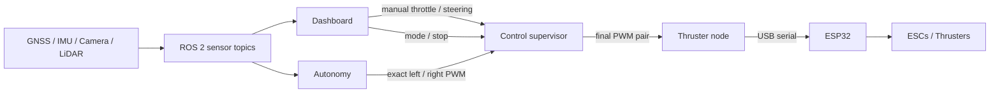

# mtr-boat-core

ROS 2 Humble software for the MTR drowning-prevention boat, running on an
Orange Pi 5 Plus.

This branch is the ROS 2 integration base. Sensors and control use standard ROS
messages, while hardware access stays in one owning node per device.

## System



The supervisor is the only command arbiter: it selects manual or automatic
control, rejects stale commands, and outputs neutral PWM when control is off.
Only the thruster node opens the ESP32 serial port.

## Hardware status

| Device | ROS interface | Status |
| --- | --- | --- |
| Serial GNSS | `/gnss/fix`, `/gnss/velocity` | Enabled by default |
| BNO055 | IMU, orientation, magnetic field, temperature, diagnostics | Default IMU and dashboard source |
| MPU-6050 | `/imu/data_raw` | Available with `imu_driver:=mpu6050` |
| Arducam UVC | `/camera/image_raw` and port 8081 viewer | Enabled by default |
| Seyond D1-R | `/lidar/points` | Opt-in |
| TI xWR18xx radar | `/radar/raw_points` | Separate ROS node |
| ESP32 thrusters | `/thrusters/command` via ROS serial owner | Opt-in |

## Quick start

Requirements:

- Orange Pi 5 Plus
- Ubuntu 22.04
- ROS 2 Humble
- `colcon`, `vcs`, and `cmake`

Create the workspace and build the pinned sensor stack:

```bash
source /opt/ros/humble/setup.bash
sudo apt update
sudo apt install -y python3-colcon-common-extensions python3-vcstool cmake

mkdir -p ~/mtr_ws/src
git clone --branch ros2-foundation --single-branch \
  https://github.com/armutie/mtr-boat-core.git \
  ~/mtr_ws/src/mtr-boat-core

~/mtr_ws/src/mtr-boat-core/scripts/bootstrap_ros2_workspace.sh ~/mtr_ws
source ~/mtr_ws/install/setup.bash
```

Install the stable hardware names once:

```bash
cd ~/mtr_ws/src/mtr-boat-core
sudo ./scripts/install_udev_rules.sh
```

This automatically maps the tested hardware to `/dev/mtr_camera`,
`/dev/mtr_esp32`, and `/dev/mtr_gnss`, regardless of USB connection order.
The aliases return automatically after reconnecting a device or rebooting.

Create the local sensor configuration:

```bash
cp ~/mtr_ws/src/mtr-boat-core/config/ros/boat.example.yaml \
  ~/mtr_ws/src/mtr-boat-core/config/ros/boat.local.yaml
nano ~/mtr_ws/src/mtr-boat-core/config/ros/boat.local.yaml
```

Launch sensors, autonomy, control, and the dashboard:

```bash
cd ~/mtr_ws
source install/setup.bash
PARAMS="$PWD/src/mtr-boat-core/config/ros/boat.local.yaml"
ros2 launch mtr_boat_core boat.launch.py params_file:="$PARAMS"
```

Open `http://<orange-pi-ip>:8080`. LiDAR, radar, thrusters, and unmeasured
mounting transforms are disabled by default.

## Common launch modes

```bash
# MPU-6050 instead of BNO055
ros2 launch mtr_boat_core sensors.launch.py \
  params_file:="$PARAMS" imu_driver:=mpu6050

# Enable the Seyond LiDAR
ros2 launch mtr_boat_core boat.launch.py \
  params_file:="$PARAMS" enable_lidar:=true

# Sensor-only bring-up
ros2 launch mtr_boat_core sensors.launch.py \
  params_file:="$PARAMS"

# Enable physical thrusters only after dry testing
ros2 launch mtr_boat_core boat.launch.py \
  params_file:="$PARAMS" enable_thruster:=true
```

Camera viewer:

```text
http://<orange-pi-ip>:8081/
```

## Headless water testing

The tested Orange Pi has a second Wi-Fi interface (`wlan1`) configured as the
`MTR-Boat` access point. NetworkManager and SSH are enabled at boot, so no
router, internet connection, monitor, or keyboard is required on the boat.
The access point uses the fixed Orange Pi address `10.42.0.1`.

After powering the boat, wait 60–90 seconds, connect the laptop to
`MTR-Boat`, and open an SSH session:

```bash
ssh uwmtr@10.42.0.1
```

### Automatic safe startup

Install the boat runtime as a system service once:

```bash
cd /home/uwmtr/mtr-boat-core-foundation
sudo ./scripts/install_systemd_service.sh
sudo systemctl start mtr-boat
```

The service starts automatically after future boots and restarts the launch
process after a failure. It starts the ESP32 serial owner, but both the control
supervisor and dashboard initialize in `off` mode and continuously command
neutral `1500/1500`. Movement still requires explicitly selecting manual or
auto control and supplying fresh commands. With the service installed, normal
headless operation is simply:

1. Power the boat and wait 60–90 seconds.
2. Connect the laptop to `MTR-Boat`.
3. Open `http://10.42.0.1:8080`.

SSH is optional for checking status and logs:

```bash
ssh uwmtr@10.42.0.1
systemctl status mtr-boat
journalctl -u mtr-boat -f
```

After pulling software changes, rebuild and restart:

```bash
cd /home/uwmtr/mtr-boat-core-foundation
source /opt/ros/humble/setup.bash
colcon build --symlink-install
sudo systemctl restart mtr-boat
```

### Manual fallback and thruster testing

Stop the automatic service before starting another launch:

```bash
sudo systemctl stop mtr-boat
```

Start the runtime inside `tmux` so it survives an SSH or Wi-Fi interruption:

```bash
tmux new -s boat
cd /home/uwmtr/mtr-boat-core-foundation
source /opt/ros/humble/setup.bash
source install/setup.bash
ros2 launch mtr_boat_core boat.launch.py
```

Detach with `Ctrl+B`, then `D`. Reattach later with:

```bash
tmux attach -t boat
```

Open the dashboard and camera from the laptop:

```text
http://10.42.0.1:8080
http://10.42.0.1:8081
```

The hotspot, SSH, and installed `mtr-boat` service start automatically after
reboot. A manual `tmux` session does not. Never run a manual boat launch beside
the service because both would try to own the same hardware.

The ESP32 bridge is available in the boot service, but control remains
off/neutral until deliberately armed from the dashboard. Stop the service
before using a separate manual ROS launch or a direct serial bench tool.

Before a water test, perform a complete headless cold-boot rehearsal using the
actual boat battery and power converter. Remove the monitor, keyboard, and wall
power; confirm the hotspot, SSH, launch, sensors, and dashboards; then run for
at least 15–30 minutes to detect power or USB instability. Wi-Fi loss is not an
emergency stop: always retain a physical motor cutoff and retrieval plan.

Basic checks:

```bash
ros2 topic list
ros2 topic hz /imu/data_raw
ros2 topic echo /gnss/fix --once
ros2 topic echo /diagnostics --once
```

Dashboard control uses ROS by default. Direct serial operation is an explicit
legacy bench mode.

## Documentation

- [ROS 2 architecture and safety boundaries](docs/ros2_architecture.md)
- [ROS 2 dashboard and thruster control](docs/control.md)
- [Stable hardware device names](docs/hardware.md)
- [BNO055 wiring and validation](docs/bno055.md)
- [Camera setup and browser viewer](docs/camera.md)
- [Seyond D1-R setup](docs/lidar.md)
- [Legacy Python bench tools and dashboard](docs/legacy_python.md)

## Repository layout

| Path | Purpose |
| --- | --- |
| `boat_ros/` | ROS 2 sensor and radar nodes |
| `imu/`, `gnss/`, `radar_nav/` | Hardware-independent drivers and logic |
| `ros2/seyond_mapping/` | Seyond PointCloud2 and mapping package |
| `launch/` | Combined sensor launch |
| `config/ros/` | ROS parameters |
| `scripts/` | Build, bench, replay, and simulation tools |
| `esp32_thruster*/` | ESP32 firmware |

## Safety

- Keep physical motor power disconnected during sensor-only tests.
- Use a physical emergency cutoff during every thruster test.
- Do not publish guessed sensor transforms.
- Validate the installed BNO055 axes and magnetic heading before autonomous
  navigation trusts absolute orientation.
- Only the ROS thruster node should own the ESP32 serial port during normal
  operation.
