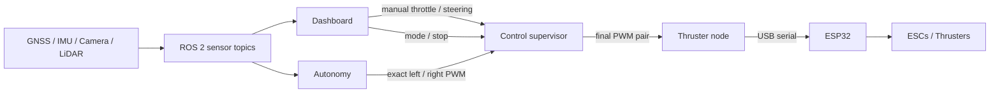

# mtr-boat-core

ROS 2 Humble software for the MTR drowning-prevention boat, running on an
Orange Pi 5 Plus.

This branch is the ROS 2 integration base. Sensors and control use standard ROS
messages, while hardware access stays in one owning node per device.

## System



The supervisor is the only command arbiter: it selects manual or automatic
control, rejects stale commands, and outputs neutral PWM when control is off.
Only the thruster node opens the ESP32 serial port.

## Hardware status

| Device | ROS interface | Status |
| --- | --- | --- |
| Serial GNSS | `/gnss/fix`, `/gnss/velocity` | Enabled by default |
| BNO055 | IMU, orientation, magnetic field, temperature, diagnostics | Default IMU and dashboard source |
| MPU-6050 | `/imu/data_raw` | Available with `imu_driver:=mpu6050` |
| Arducam UVC | `/camera/image_raw` and port 8081 viewer | Enabled by default |
| Seyond D1-R | `/lidar/points` | Opt-in |
| TI xWR18xx radar | `/radar/raw_points` | Separate ROS node |
| ESP32 thrusters | `/thrusters/command` via ROS serial owner | Opt-in |

## Quick start

Requirements:

- Orange Pi 5 Plus
- Ubuntu 22.04
- ROS 2 Humble
- `colcon`, `vcs`, and `cmake`

Create the workspace and build the pinned sensor stack:

```bash
source /opt/ros/humble/setup.bash
sudo apt update
sudo apt install -y python3-colcon-common-extensions python3-vcstool cmake

mkdir -p ~/mtr_ws/src
git clone --branch ros2-foundation --single-branch \
  https://github.com/armutie/mtr-boat-core.git \
  ~/mtr_ws/src/mtr-boat-core

~/mtr_ws/src/mtr-boat-core/scripts/bootstrap_ros2_workspace.sh ~/mtr_ws
source ~/mtr_ws/install/setup.bash
```

Install the stable hardware names once:

```bash
cd ~/mtr_ws/src/mtr-boat-core
sudo ./scripts/install_udev_rules.sh
```

This automatically maps the tested hardware to `/dev/mtr_camera`,
`/dev/mtr_esp32`, and `/dev/mtr_gnss`, regardless of USB connection order.
The aliases return automatically after reconnecting a device or rebooting.

Create the local sensor configuration:

```bash
cp ~/mtr_ws/src/mtr-boat-core/config/ros/boat.example.yaml \
  ~/mtr_ws/src/mtr-boat-core/config/ros/boat.local.yaml
nano ~/mtr_ws/src/mtr-boat-core/config/ros/boat.local.yaml
```

Launch sensors, autonomy, control, and the dashboard:

```bash
cd ~/mtr_ws
source install/setup.bash
PARAMS="$PWD/src/mtr-boat-core/config/ros/boat.local.yaml"
ros2 launch mtr_boat_core boat.launch.py params_file:="$PARAMS"
```

Open `http://<orange-pi-ip>:8080`. LiDAR, radar, thrusters, and unmeasured
mounting transforms are disabled by default.

## Common launch modes

```bash
# MPU-6050 instead of BNO055
ros2 launch mtr_boat_core sensors.launch.py \
  params_file:="$PARAMS" imu_driver:=mpu6050

# Enable the Seyond LiDAR
ros2 launch mtr_boat_core boat.launch.py \
  params_file:="$PARAMS" enable_lidar:=true

# Sensor-only bring-up
ros2 launch mtr_boat_core sensors.launch.py \
  params_file:="$PARAMS"

# Enable physical thrusters only after dry testing
ros2 launch mtr_boat_core boat.launch.py \
  params_file:="$PARAMS" enable_thruster:=true
```

Camera viewer:

```text
http://<orange-pi-ip>:8081/
```

Basic checks:

```bash
ros2 topic list
ros2 topic hz /imu/data_raw
ros2 topic echo /gnss/fix --once
ros2 topic echo /diagnostics --once
```

Dashboard control uses ROS by default. Direct serial operation is an explicit
legacy bench mode.

## Documentation

- [ROS 2 architecture and safety boundaries](docs/ros2_architecture.md)
- [ROS 2 dashboard and thruster control](docs/control.md)
- [Stable hardware device names](docs/hardware.md)
- [BNO055 wiring and validation](docs/bno055.md)
- [Camera setup and browser viewer](docs/camera.md)
- [Seyond D1-R setup](docs/lidar.md)
- [Legacy Python bench tools and dashboard](docs/legacy_python.md)

## Repository layout

| Path | Purpose |
| --- | --- |
| `boat_ros/` | ROS 2 sensor and radar nodes |
| `imu/`, `gnss/`, `radar_nav/` | Hardware-independent drivers and logic |
| `ros2/seyond_mapping/` | Seyond PointCloud2 and mapping package |
| `launch/` | Combined sensor launch |
| `config/ros/` | ROS parameters |
| `scripts/` | Build, bench, replay, and simulation tools |
| `esp32_thruster*/` | ESP32 firmware |

## Safety

- Keep physical motor power disconnected during sensor-only tests.
- Use a physical emergency cutoff during every thruster test.
- Do not publish guessed sensor transforms.
- Validate the installed BNO055 axes and magnetic heading before autonomous
  navigation trusts absolute orientation.
- Only the ROS thruster node should own the ESP32 serial port during normal
  operation.
